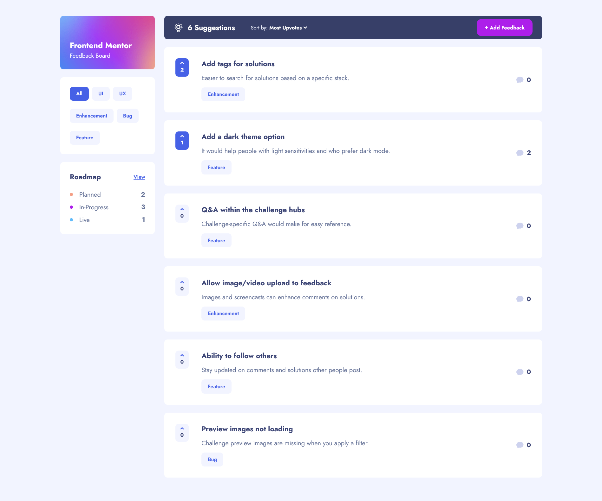

# Frontend Mentor - Product feedback app solution

This is a solution to the [Product feedback app challenge on Frontend Mentor](https://www.frontendmentor.io/challenges/product-feedback-app-wbvUYqjR6). Frontend Mentor challenges help you improve your coding skills by building realistic projects.

## Table of contents

- [Overview](#overview)
  - [The challenge](#the-challenge)
  - [Screenshot](#screenshot)
  - [Links](#links)
- [My process](#my-process)
  - [Built with](#built-with)
  - [What I learned](#what-i-learned)
- [Author](#author)

## Overview

### The challenge

Users should be able to:

- View the optimal layout for the app depending on their device's screen size
- See hover states for all interactive elements on the page
- Create, read, update, and delete product feedback requests
- Receive form validations when trying to create/edit feedback requests
- Sort suggestions by most/least upvotes and most/least comments
- Filter suggestions by category
- Add comments and replies to a product feedback request
- Upvote product feedback requests

### Screenshot



### Links

- Live site URL: [https://productfeedbackappfm.netlify.app/](https://productfeedbackappfm.netlify.app/)

## My process

### Built with

- Semantic HTML5 markup
- TailwindCSS
- Flexbox
- CSS Grid
- Mobile-first workflow
- [Next.js](https://nextjs.org/) - React framework
- [MongoDB](https://www.mongodb.com/) - Document database
- [Clerk](https://clerk.com/) - Authentication and user management
- [TanStackQuery](https://tanstack.com/query/latest) - Asynchronous state management

### What I learned

In this project I finally learned and use some accessability for elements that default can't be accessible. I did this in the select dropdown component. When dropdown is open it should switch between items using Tab press and when dropdown is not open it should skip its items and go to next element which is in this exmaple the Add Feedback link. Probably I have should added aria-label to this example.

```js
    <li 
        tabIndex={dropdownOpen ? 0 : -1} 
        key={item} 
        className='flex justify-between items-center px-5 py-3 border-b border-b-light-3 text-dark-3 text-7 md:text-5 cursor-pointer hover:text-primary-1 transition duartion-300 focus:text-primary-1' 
        onClick={() => handleClickDropdownItem(item)}
        onKeyDown={(event) => handleKeyDown(event, item)}>
        {item} {activeItem === item && <IconCheck />}
    </li>
```

## Author

- Frontend Mentor - [@mateuszbizon](https://www.frontendmentor.io/profile/mateuszbizon)